> **Ideas Worth Spreading**

This is my second TEDx. I've been to [TEDxPortland: Wonderland](https://history.tedxportland.com/wonderland) in 2016, and it absolutely blew my mind. I didn't have a chance to attend Seattle's show last year, so as soon as tickets went on sale in 2019, I grabbed one.

[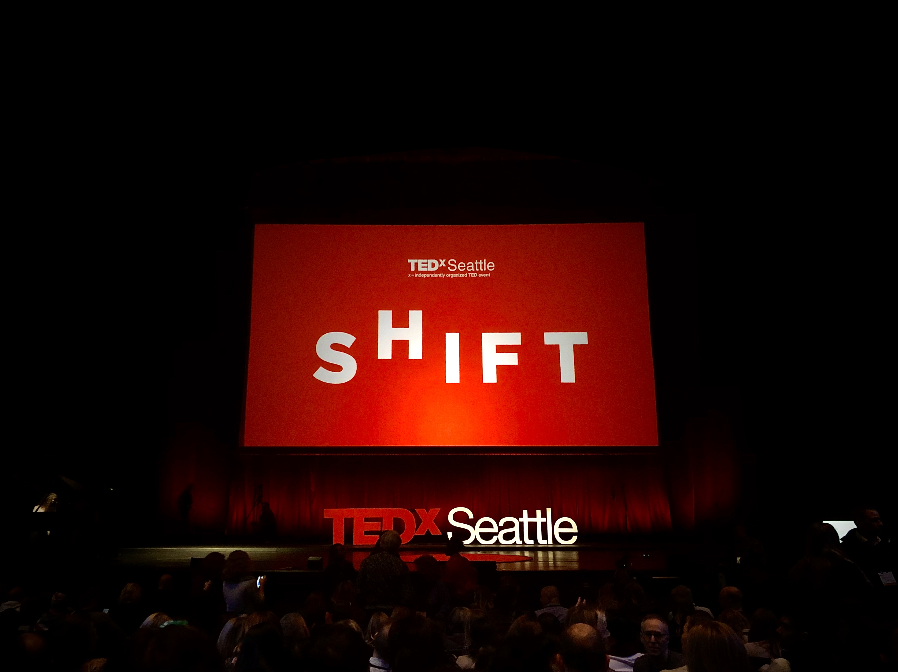](https://tedxseattle.com)

As I'm writing this, it's "Session 5" (the intermission); I'm sitting at the top level of jam-packed [McCaw Hall](https://www.mccawhall.com/) in Seattle, and I'm trying to process talks as they come.

## Takeaways

- Pain is subjective, people are single-taskers, and diverting attention from pain significantly reduces pain experience
- What people of color see around them from the young age makes them feel invalid since media portrays almost exclusively white people and relationships as the norm
- Enemies are still human. We can have conversations with them, and make human connections to promote change we're seeking.
- Mental illness sucks. But SMEDMERTS (“**S**leep **M**eds **E**at **D**octor **M**indfulness **E**xercise **R**outine **T**ools **S**upport system”) is here to help (gotta read the book to get the reference!)
- Talking to strangers is a great way to expand your horizons
- Orcas are _much_ smarter than we think
- HIV is likely to be eradicated within our lifetime
- Expressing gratitude now is always better than reading a glowing obituary over an open casket
- We know almost nothing about the world around us, and we all are mostly empty space
- We must adapt our education to youth culture. Duh!
- There might be a better approach to fighting climate change than scaring everyone to death

## Talks

## Pain and Virtual Reality

[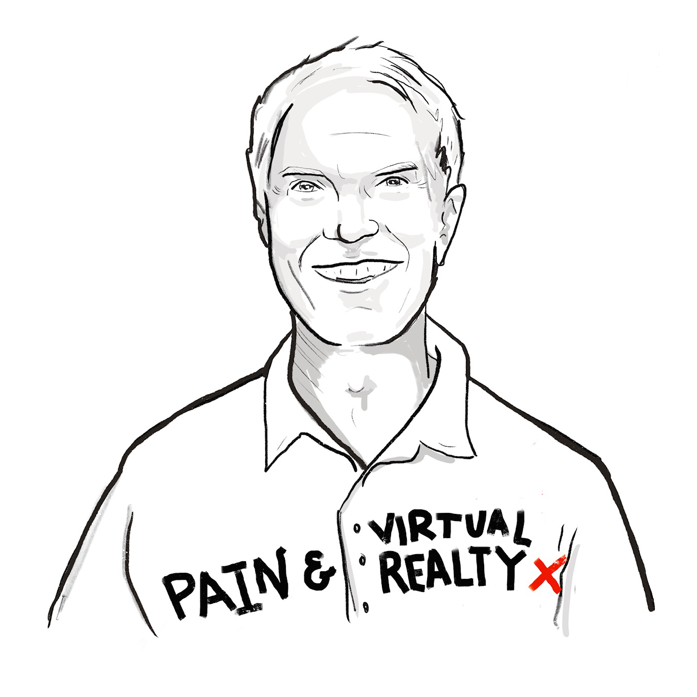](https://tedxseattle.com/speakers/sam-sharar/)

[Sam Sharar](https://tedxseattle.com/speakers/sam-sharar/) talked about using virtual reality to ease pain in severely burned patients. Convincing and a clear example of _fad_ technology being life-changing.

## Unconscious Bias

[Karen Okonokwo](https://tedxseattle.com/speakers/karen-okonkwo/) talked about unconscious bias when it comes to representation of black faces in various media, and how it affects non-white people growing up. It's eye-opening how we unconsciously perceive certain things as the norm just because we see them everywhere. Try for example searching for "couple" or "boss". Karen started a minority-focused [stock photography website](https://tonl.co/), and it's so awesome to see their work spreading around!

## Animal Advocacy

[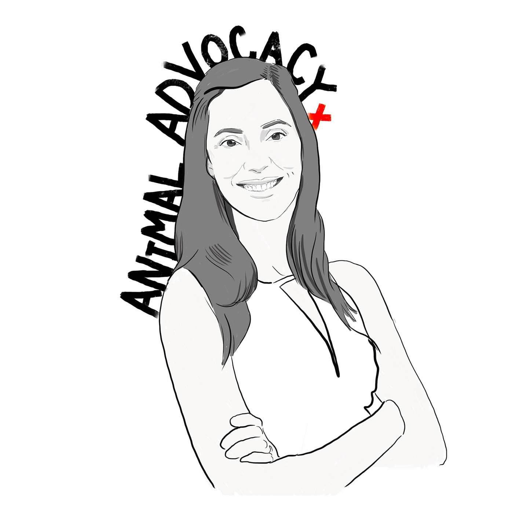](https://tedxseattle.com/speakers/leah-garces/)

[Leah Garcés](https://tedxseattle.com/speakers/leah-garces/) talked about going to the perceived enemy and making a human connection to promote change. She's an avid animal advocate fighting with factory farming. It's awesome to see farmers turn their chicken factories into hemp and marijuana greenhouses! Also, [Beyond Meat](https://www.beyondmeat.com/) and [Impossible Foods](https://impossiblefoods.com/) (and those who follow) are holding keys to the future of food. Yep. Called it!

## Creativity and Mental Health

[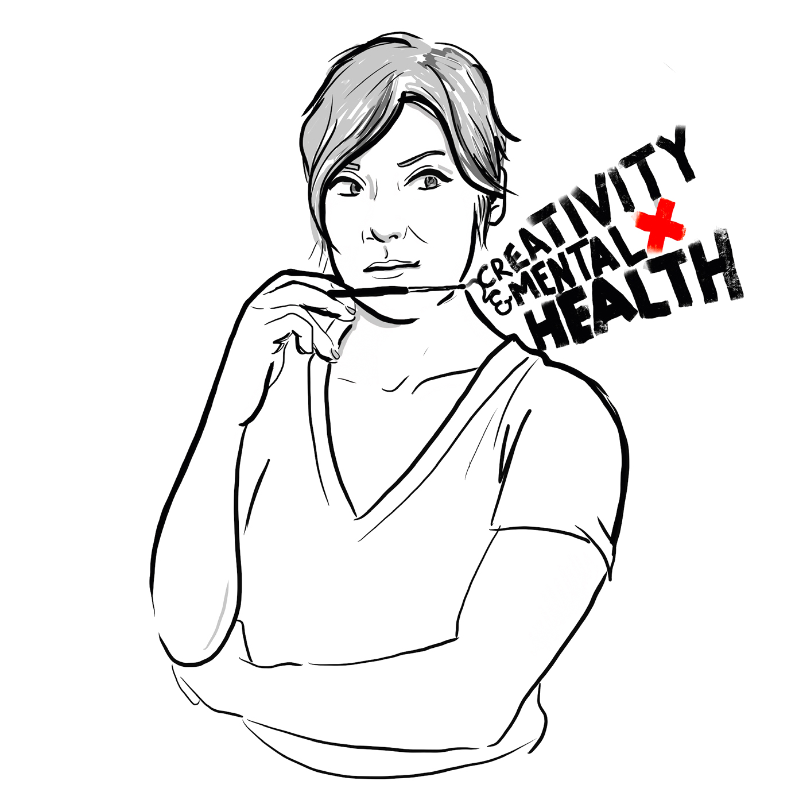](https://tedxseattle.com/speakers/ellen-forney/)

[Ellen Forney](https://tedxseattle.com/speakers/ellen-forney/) gave a great talk about her journey through bipolar disorder. Bipolar is a nasty disease, where you go from suicidally depressed to complete maniac a few times a year (this is Bipolar Type 1; there's also type 2, where you go from a deep depression to being almost maniac; basically, it's just a dialed down version of the same illness). Definitely buying her [Rock Steady](https://amzn.to/33gfapv) book - awesome book by a "crazy artist".

## Everyone Has a Story

[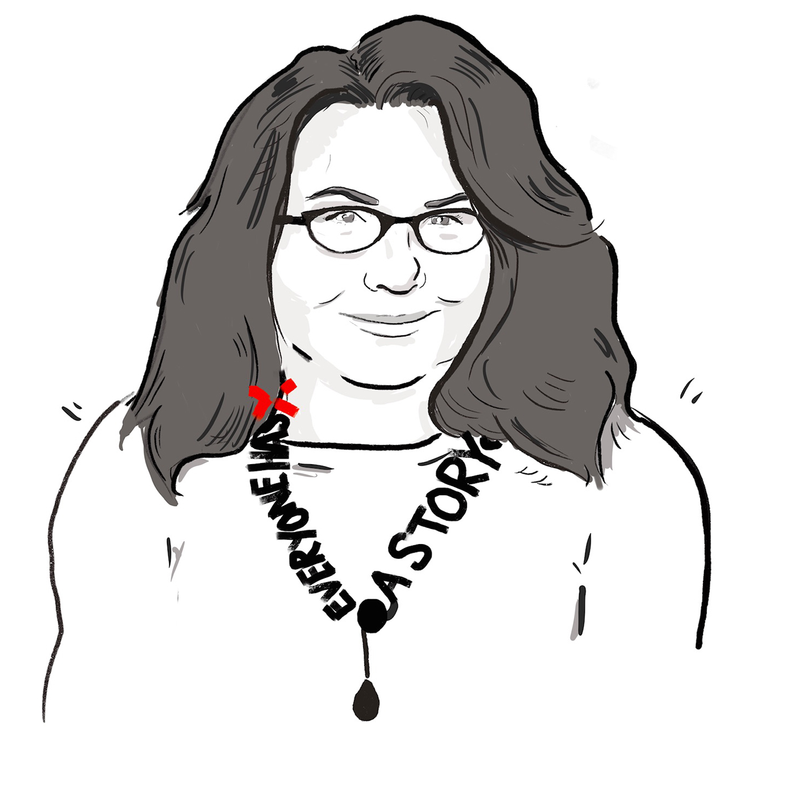](https://tedxseattle.com/speakers/traca-savadogo/)

[Traca Savadogo](https://tedxseattle.com/speakers/traca-savadogo/) talk was focused on striking a conversation with a stranger, and where this might lead. Excellent example of how we think that something might be awkward and miss out on great opportunities.

## Wisdom of Salmon

[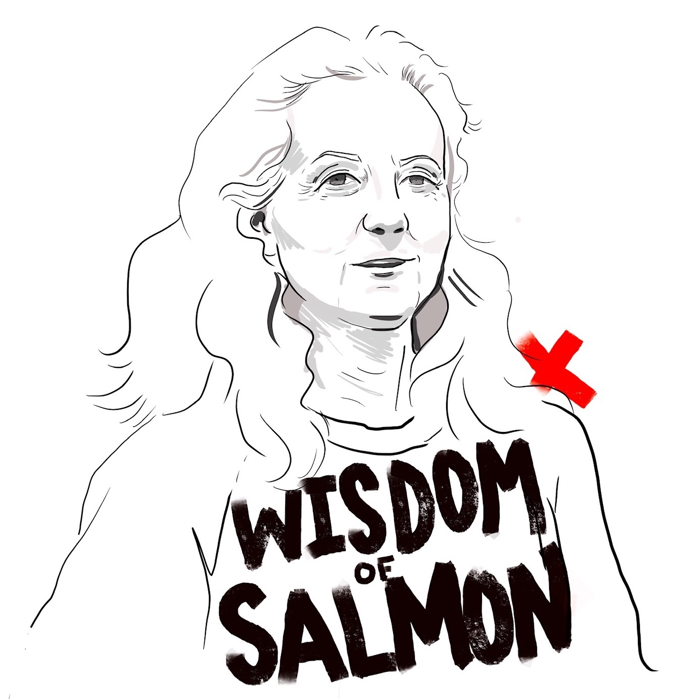](https://tedxseattle.com/speakers/alexandra-morton/)

[Alexandra Morton](https://tedxseattle.com/speakers/alexandra-morton/) explained how researching salmon and taking hints from orcas can make our lives so much better, make our water and air cleaner, and lead to a sustainable future of our species.

## Art in Our Community

[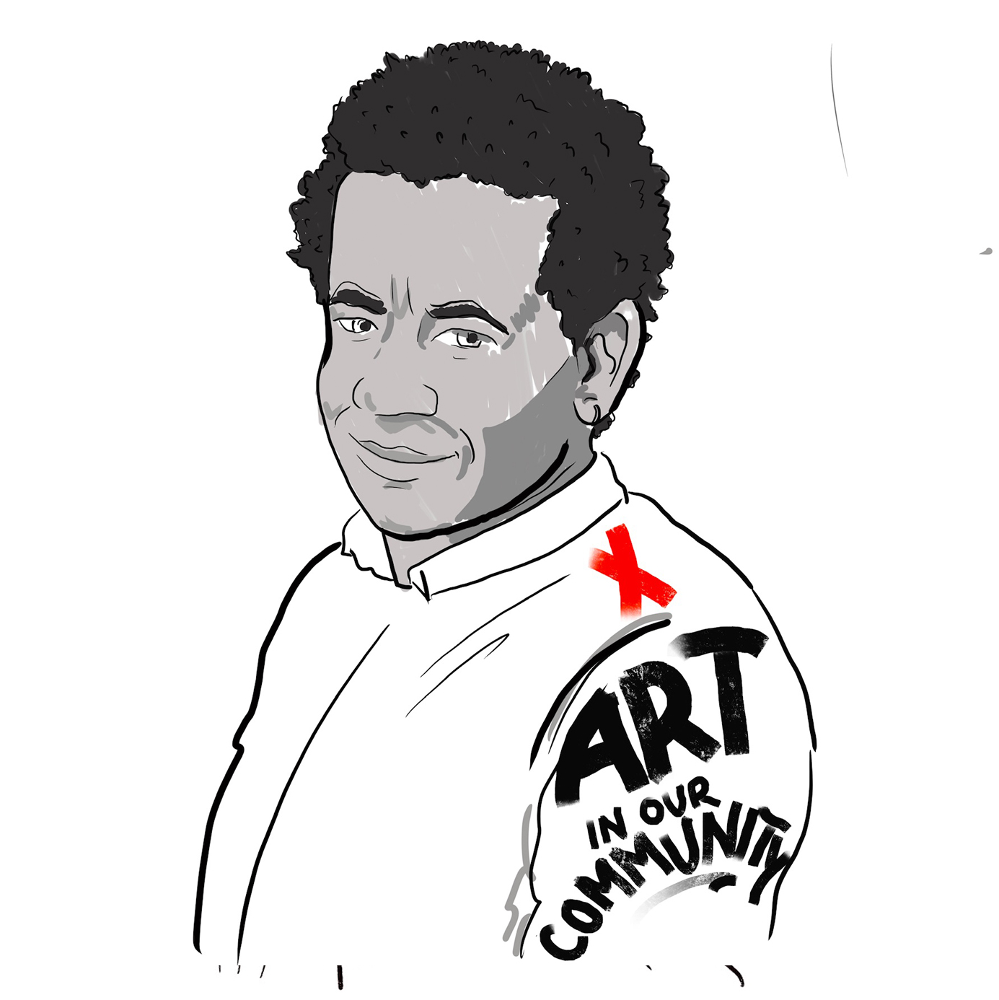](https://tedxseattle.com/speakers/james-miles/)

Great point made by [James Miles](https://tedxseattle.com/speakers/james-miles/): around Grades 3-4, we stop embracing kid's culture when trying to teach them at school, but we, obviously, shouldn't. Educators must embrace youth culture to make learning more engaging and successful. Take, for example, hip-hop, and try explaining Romeo and Juliette in terms young people can not only understand, but also can relate to :)

## Gene Editing - Eradicate HIV

[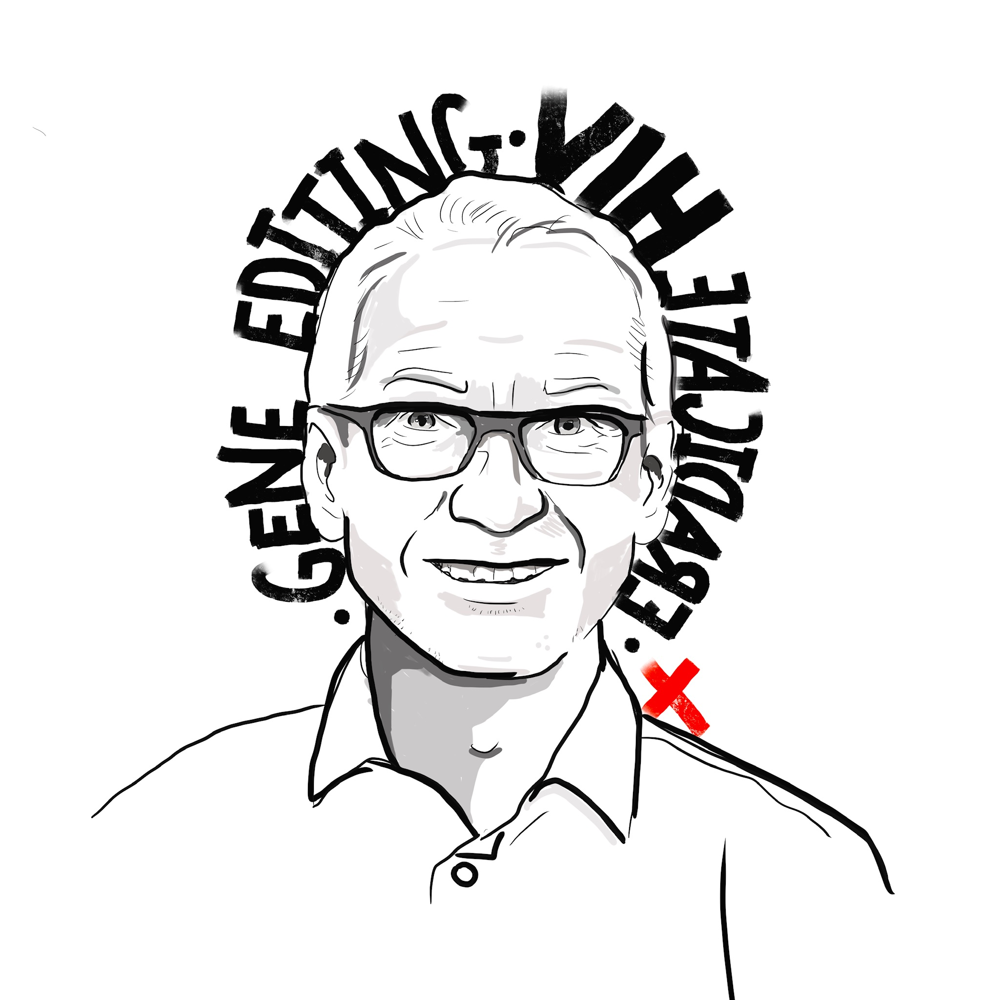](https://tedxseattle.com/speakers/dr-hans-peter-kiem/)

There was some commotion before [Hans-Peter Kiem's](https://tedxseattle.com/speakers/dr-hans-peter-kiem/) talk, it happens every now and again when someone thinks they could just hijack the attention of 3000+ people at once; it never works, though. Anywho, apparently, CRISPR and other gene editing technologies are capable of curing HIV. And there is a way to deliver this cure to millions in our lifetime!

## Lessening Pain - Boosting Happiness

[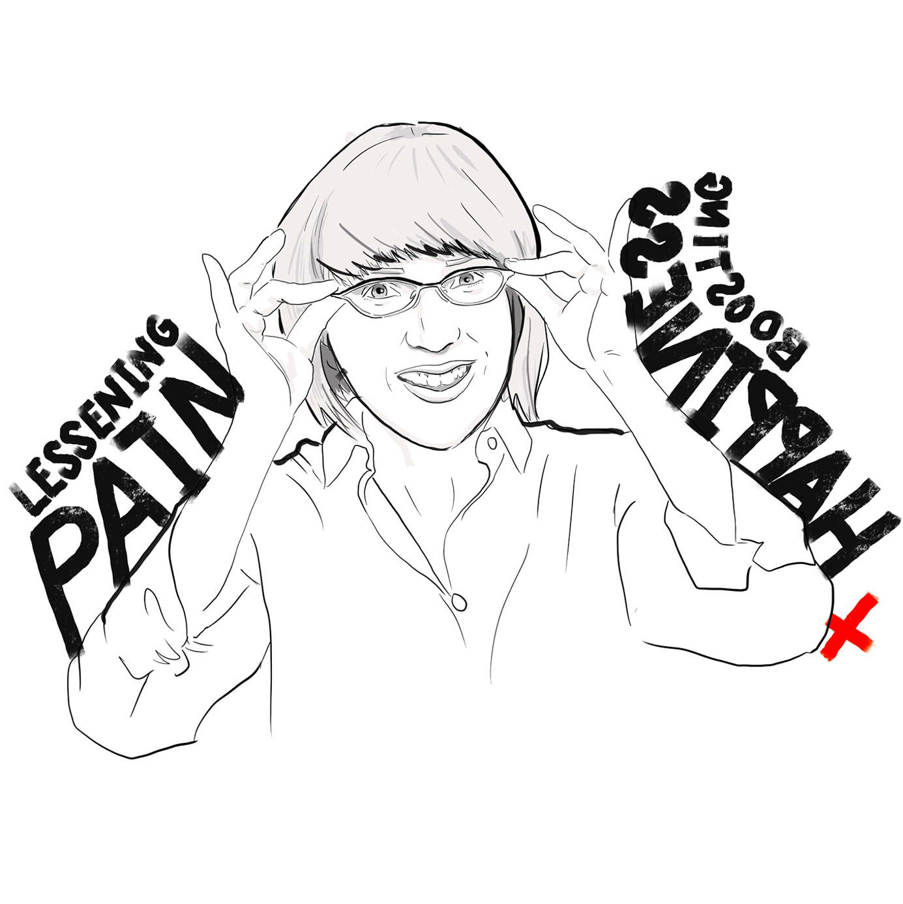](https://tedxseattle.com/speakers/andrea-driessen/)

[Andrea Driessen](https://tedxseattle.com/speakers/andrea-driessen/) worked as a volunteer at a hospice, and got to see people nearing death. She talked with them and helped them express their feelings to their loved ones. It also gave you a perspective on life and death, and I can very much relate to it.

## Demystifying Complexity

[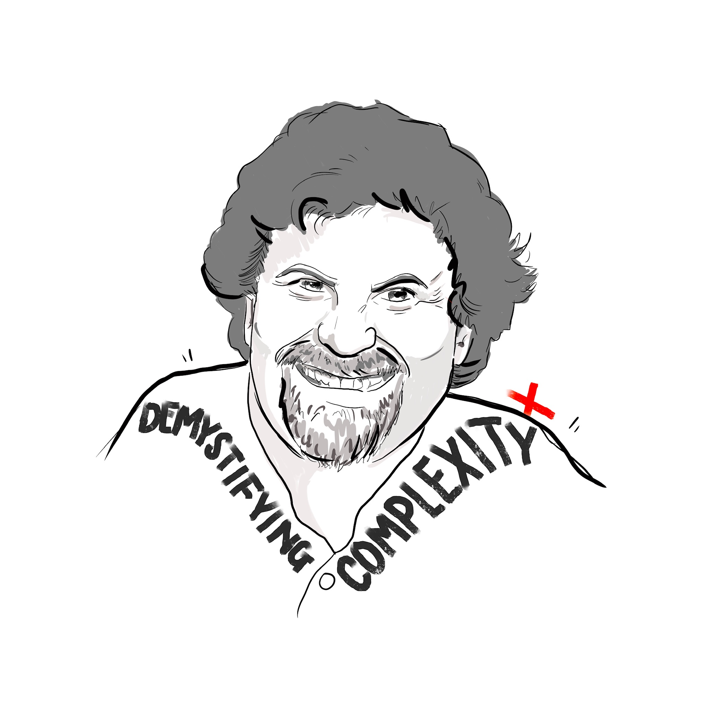](https://tedxseattle.com/speakers/david-blatner/)

[David Blatner](https://tedxseattle.com/speakers/david-blatner/) wrote a bunch of books on topics he knew very little about. His research led him to mind-blowing discoveries, and he was able to put them into words. He also made hard-to-measure concepts easier to grasp.

## Saving Beauty

[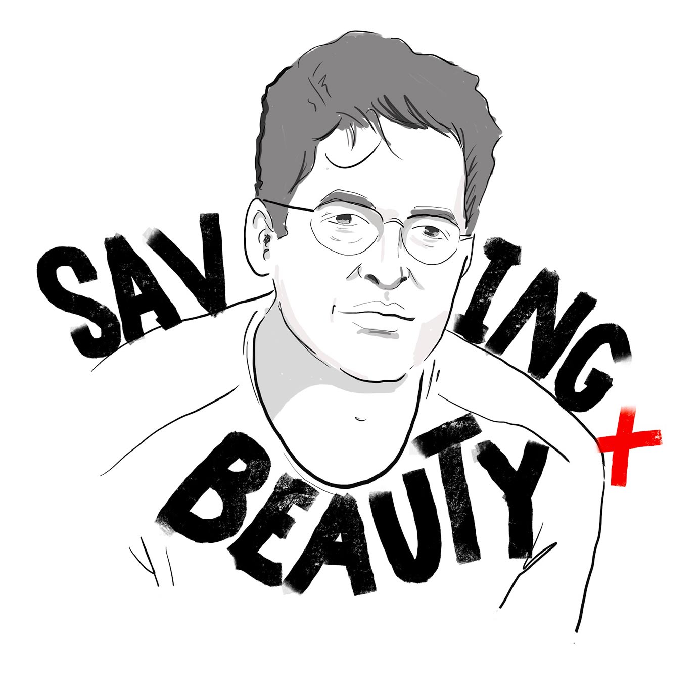](https://tedxseattle.com/speakers/chris-jordan-2/)

Perhaps, the most controversial talk by [Chris Jordan](https://tedxseattle.com/speakers/chris-jordan-2/). The main point was that we should stop scaring ourselves with climate change and turn to beauty. This was the only talk I can't agree with, and the only one not making it clear what exactly the speaker thinks is the answer (or at least what specific possible answers are there).
