This week my report comes a bit late but for a good reason. I just returned from my 2-night hike to White Pass, and jeesh was it rough! Now I'm thinking it would be madness to attempt the [Stevens Pass to Snoqualmie Pass](https://www.wta.org/go-hiking/hikes/pacific-crest-trail-section-j-snoqualmie-pass-to-stevens-pass-east), Section J, of the PCT this year. Hell, I'm not even sure I can do my Plan B, the [Loowit Trail](https://www.wta.org/go-hiking/hikes/loowit) anymore! But hey, let me decompress a little, think, plan some more and see how it goes.

> 60,000+ steps, 600 floors. I also lost 8 lbs in 2 days.

The plan was simple: arrive at Sloan Creek campground on Thursday, camp for the night. On Friday hike to White Pass. On Saturday hike back. Simple enough. 

As always, I had a plan B: hike to Mackinaw shelter, camp there, and hike back on Saturday. This would be a chill and relaxed 12 miles over two day. 

  <ReactTinyLink
    cardSize="small"
    showGraphic={true}
    maxLine={2}
    minLine={1}
    url="https://www.wta.org/go-hiking/hikes/north-fork-sauk-river"
  />

## Adventure
This was my first `Hard` trail, and I didn't expect it to be any less then a painful struggle with payoff in a form of spectacular overview of Washington's Cascade peaks and chill evenings in my tent. 

> Of course, nothing went according to plan.

I arrived at the parking lot later than planned. I knew that Mountain Loop highway was pretty bad, and indeed 16 miles from Darrington down to Forest Service road 49 (it's actually marked as NF-49, National Forest road) and then about 7 miles to the trailhead took me over an hour. The road is rough but passable, even for someone in a Civic Coupe. 

Anyway, Thursday night was pretty empty at the campground, and I had no issue setting up my tent in a secluded area not too far from the river.

It was raining a little bit, and setting up a new tent for the first time in the wild was not too fun. Moreover, apparently, I didn't bring enough ground stakes. As a result, I didn't get proper ventilation inside the tent overnight and I woke up all damp and wet: condensation is a bitch.

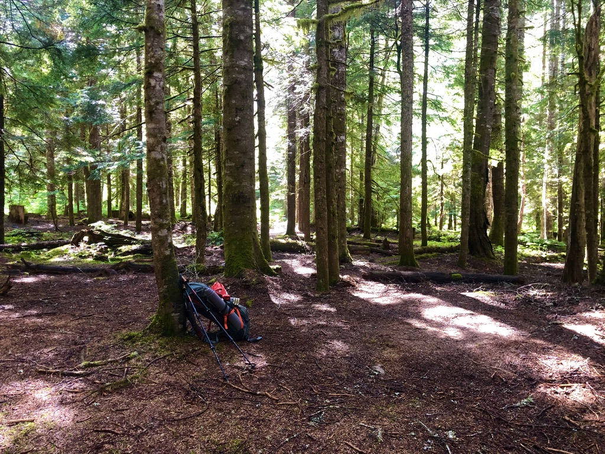

After breakfast, I hit the trail towards Mackinaw Shelter, a known landmark at the end of the North Fork Saul trail right before it climbs uphill to White Pass. Unfortunately, the shelter collapsed a few years ago. Now it's just a bunch of rubble :(

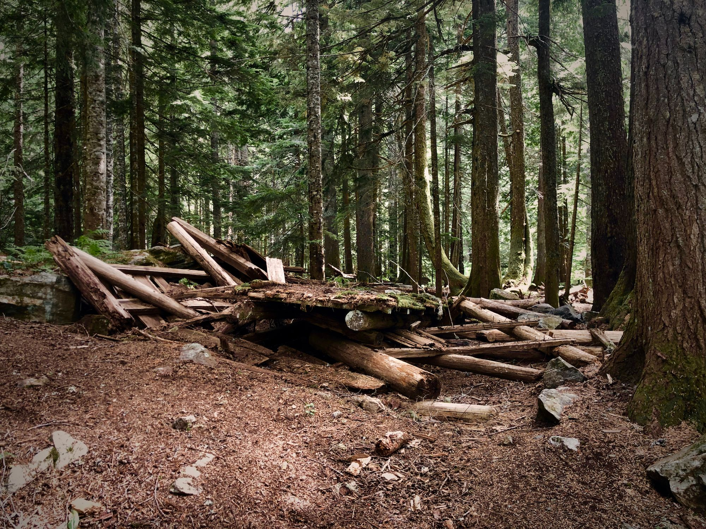

Still, there's a nice campground area around with river access, and it's perfectly suited for a nice and chill overnight or a relaxing lunch break.
The trail all the way to the shelter goes relatively flat along the North Fork Sauk river through [Sauk-Suiattle](https://en.wikipedia.org/wiki/Sauk-Suiattle_Indian_Tribe_of_Washington) native land. It's mostly shaded and crosses a bunch of tiny streams. There's only one place on the trail that requires some scrambling due to a downed tree.

Quiet, chill stroll among the old growth forest. A lot of moss, green, shade, a lot of little critters running around. Mosquitos are a concern.

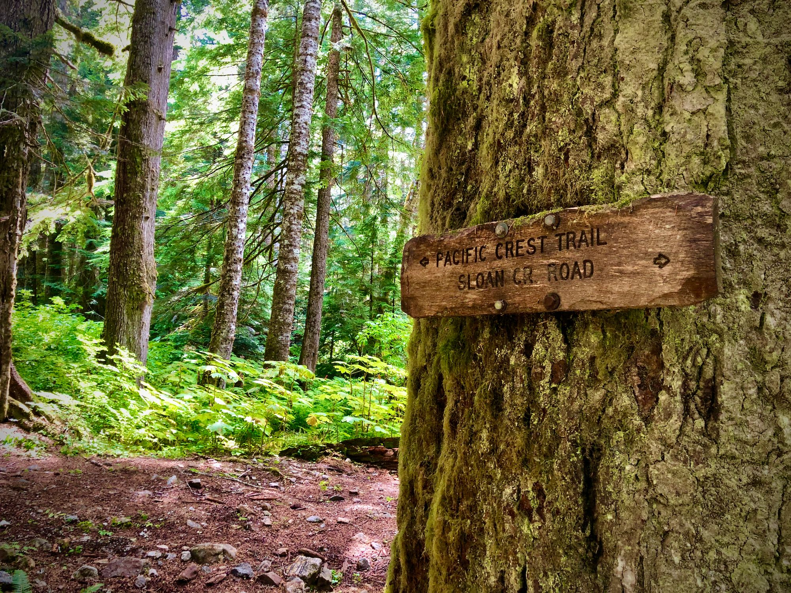
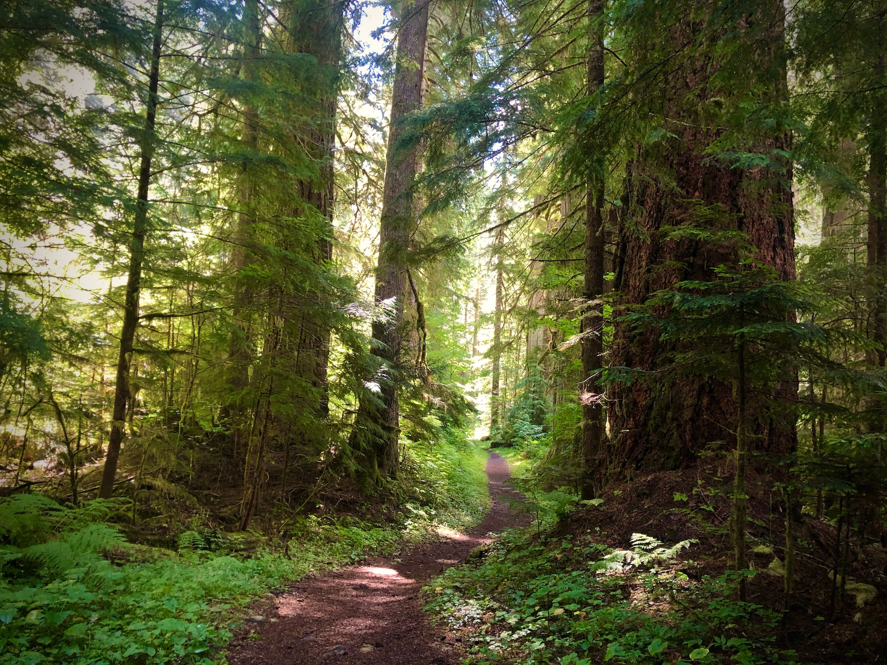

Anyway, after a quick lunch at Mackinaw Shelter campground, I made an executive decision to proceed all the way to White Pass, 3,000 ft ascent over ~3 miles. It was around 4 pm and I figured I'd be there before dark. Boy, was I wrong.
The trail starts at around 3,000 ft of elevation, and for the next 3 miles it goes straight up. Yes, there are switchbacks, but it's for real, a full-on ascent non-stop. There are no flat segments. The trail itself is much different from a soft forest trail. It's very rocky in places, there are a few spots where the trail becomes a stream for a few yards; on my way back, I slipped and fell flat on my butt in one of these streams 😂

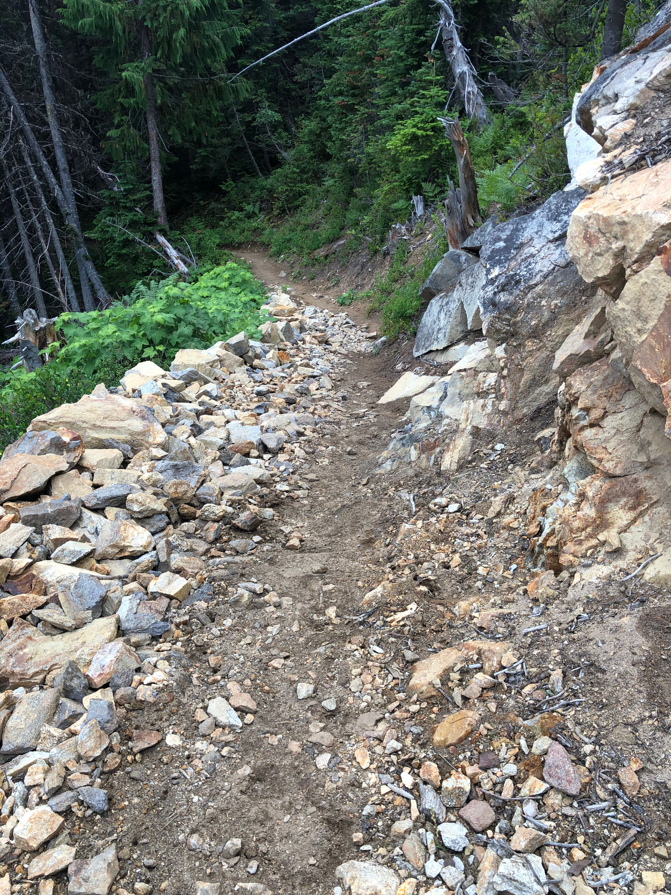

I was moving very slowly. I was taking short breaks every few hundred yards, long breaks every 500 ft of elevation gain. Yes, my pace was at about 2 hours/mile, but I'm absolutely convinced that this approach is the only reason I was able to make it all the way to the top. But you know what they say: [HYOH](https://www.pcta.org/journalist/post/hike-your-own-hike-what-does-it-mean/).
The weather was fairly clear, but the ascent was so strenuous that I took only a few pictures. "After I get to top, tomorrow, I'll make all the pictures in the world, from a better position!", I though. 

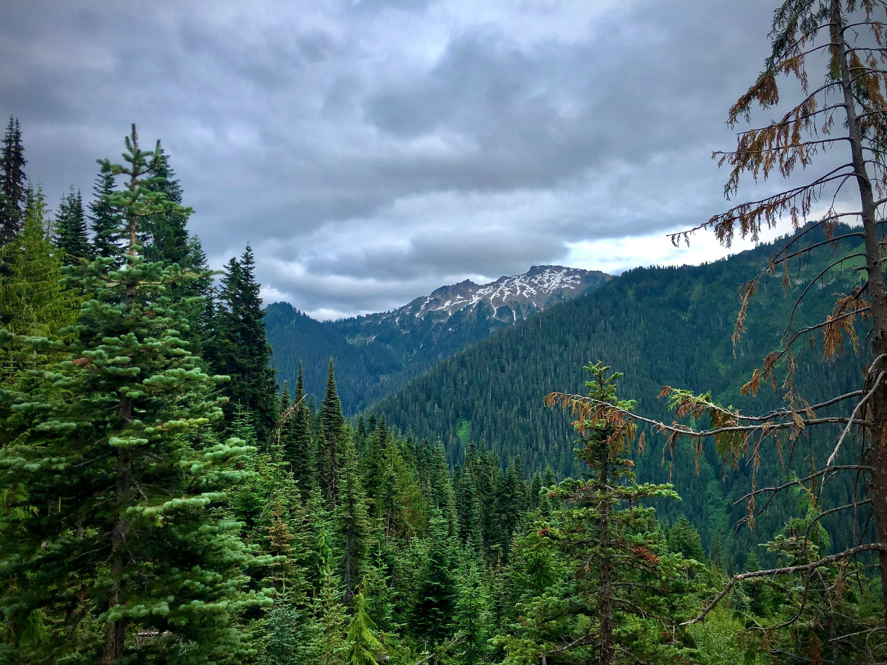

I ended up traveling the last mile and a half in complete darkness. My headlamp died on me, it started drizzling, and a thick fog settled around. So here I am, in the dark, on a narrow trail on a mountainside with about 3000-feet drop on the right and a vertical hill on the left; by this time, I ran out of water, and illuminated my way with my iPhone flashlight. After a Fucking Fuck creek (yes, I named a dried out creek, sue me!), I finally came across a stream and refilled my water bottle. I successfully made it to the intersection of my trail with the PCT, and from there it was a fairly easy hike to White Pass camp area. 

When my iPhone died, I found another, dimmer flashlight and used it to navigate the camp area. In the fog, at night and through drizzle, it was not easy. So much so that as soon as I saw a lit tent in the distance, I started to look for any flat surface to pitch my tent. While stumbling around a meadow, I startled a bunch of deer, who didn't expect me there at that hour, I guess.
Now, I'm in some meadow, exhausted, wet, aching all over, my backup flashlight is about to die, and I need to pitch a tent that is still very new to me. It took me about 20 minutes to complete this task, and by the time I got inside and set my sleeping system, it was close to midnight. I sent a check-in message to family and dropped asleep.

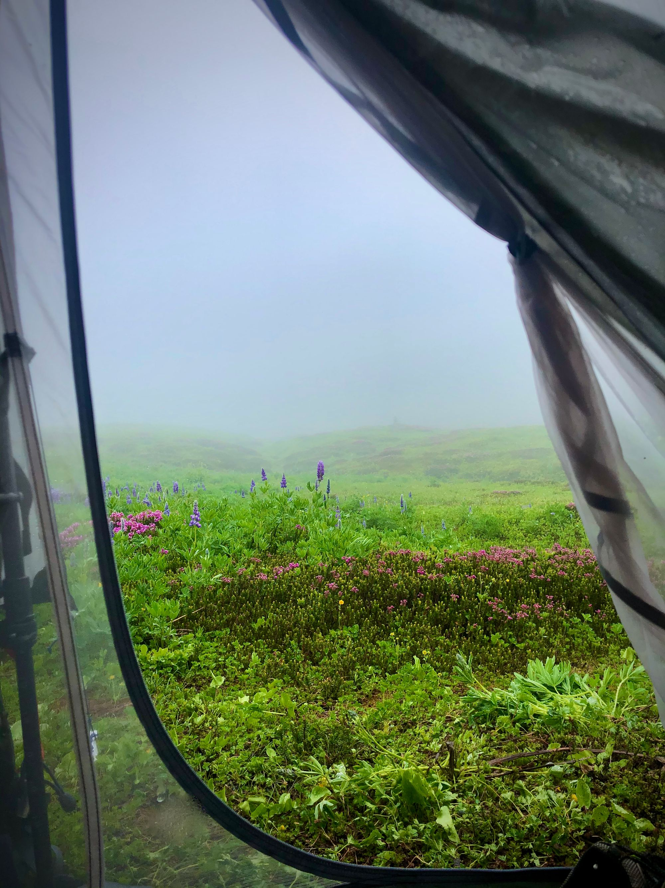

Yeah, morning was refreshing. It was cloudy and foggy, and you couldn't see anything anywhere. Which is a pity; one of the points of hiking this high and seeing all the peaks and volcanoes... Oh, well.

Here's a picture of gorgeous 10,500-feet Glacier Peak, known in the Sauk-Suiattle dialect of the [Lushootseed](https://en.wikipedia.org/wiki/Lushootseed) language as "Tda-ko-buh-ba" or "Takobia". It is the most isolated stratovolcano in the Cascade Range. Beautiful, isn't it? It's the 4th highest point in Washington after Tahoma, Pahto, and Kulshan (Rainier, Adams and Baker)

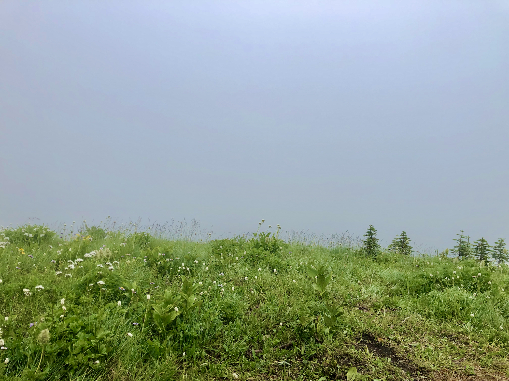

After breakfast, I refilled all my water containers, and headed back to the parking lot. White Pass is a pretty busy area at this time of year with a lot of hikers and climbers arriving on Saturday morning. By this time I looked dirty, wet and tired enough for incoming hikers to ask me where the nearest water source is, how to get to the camp or this other trail, where toilets are and so on. On my long and fairly slow descent, I met a lot of people (mostly climbers) and we had a few brief conversations. A bunch of people who overtook me were in my camp of disappointed by the weather. 

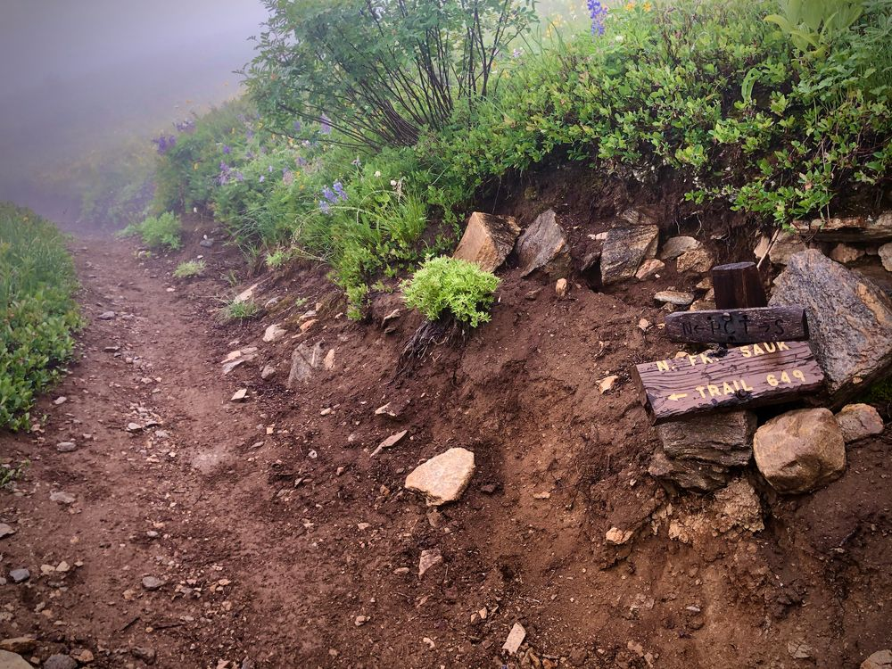

A quick peak-a-boo of Mt. Jackson is all I've got on my way back. I can only imagine how fantastically beautiful the scenery is on a clear day!..

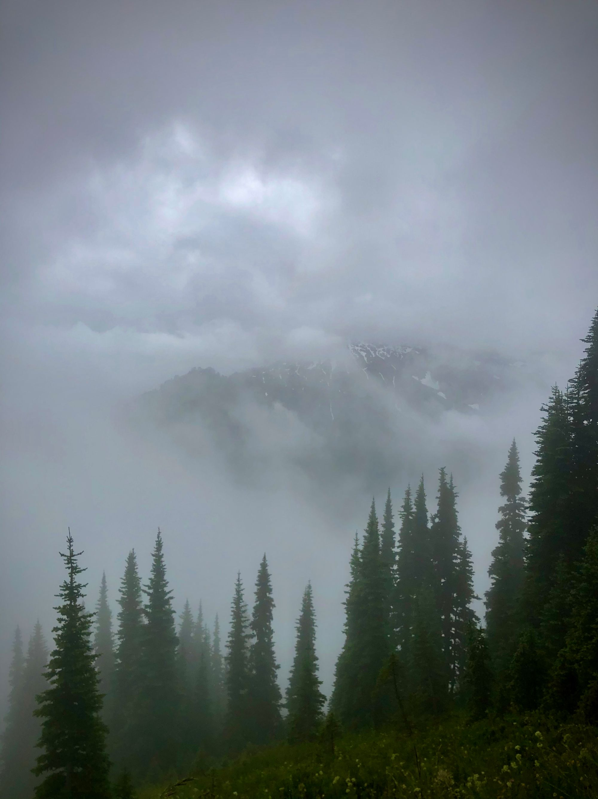

I wanted to stop at Mackinaw Shelter again on my way back for a break and water refill, but I missed it. I was looking for a creek crossing first, never crossed this creek, and when I finally got to it, well, Mackinaw Shelter was like 2 miles back.

The creek I was looking for was Red Creek; it has a nice camping area with a ton of spacious dispersed tent spots, firepits and such. But for me, it was all about the creek at that point. I just laid on my back besides roaring water before refilling my water bottle and heading straight back to the parking lot.

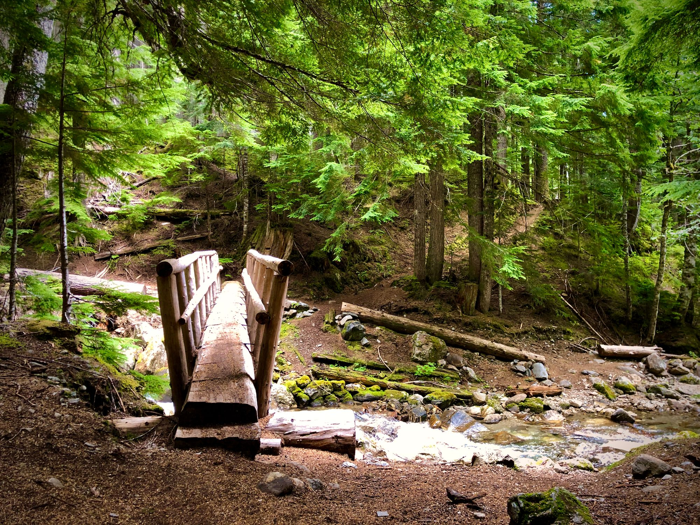

About a mile away from the trailhead, another peak-a-boo happened, that I didn't really expect. It was just after sunset, and it was a nice (if a bit ironic) closure to my peak-watching hike.

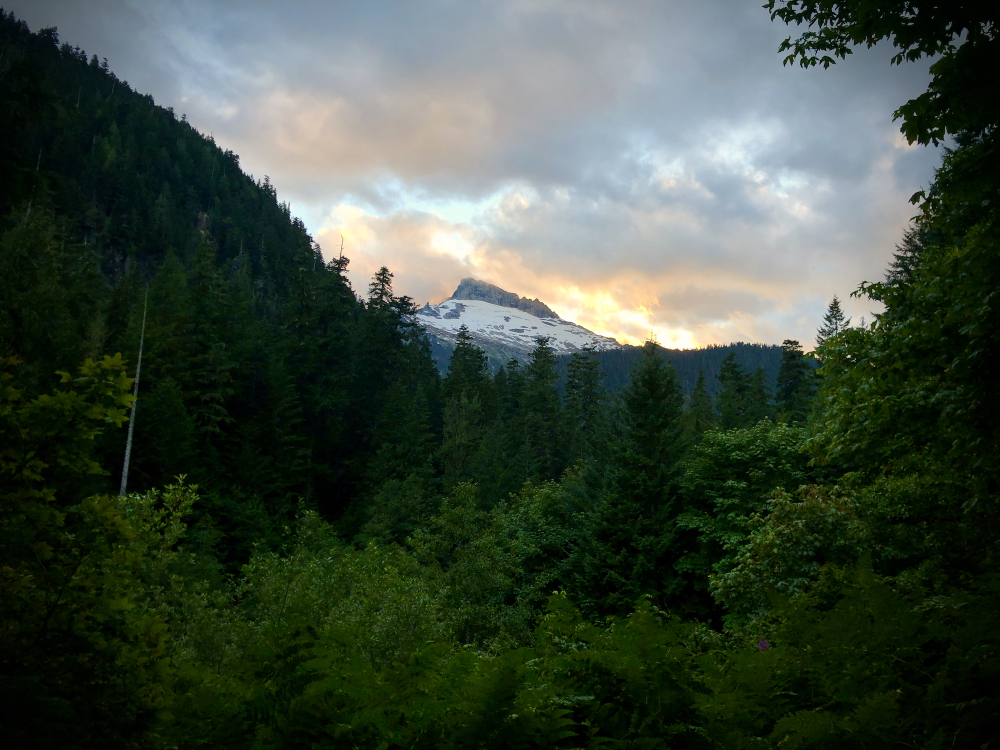

## Notes
I forgot my hat and had to fashion headgear out of a face mask (?)

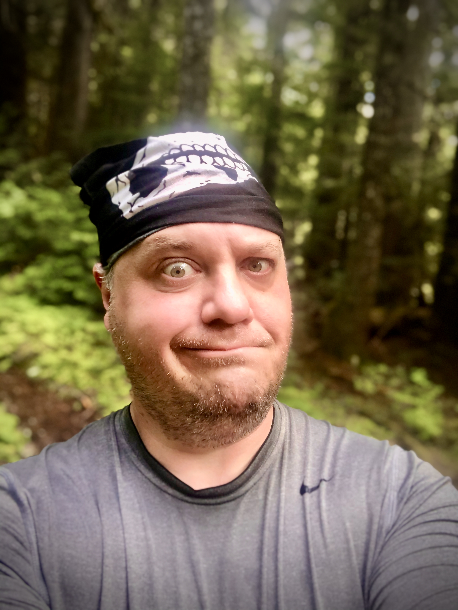

Looks like, as always, I carried 70% more food than needed. I literally only had 2 breakfasts and 2 snacks. I brought 4 full meals and most snacks back. 
After my hactic night arrival at White Pass, my pack got disorganized beyond repair. By morning, I was unable to organize it back to the proper state. Need to learn this skill.

My hiking shoes are .5 size too small. I mean, they are half a size larger then I'd normally wear, but it's still too small. Will try to exchange them for a bigger pair at REI 🤞

I ran out of bug spray. There must be some other way to repell mosquitos without bathing in bug spray 🤔

Never ever under any circumstances cut costs on your headlamp. Buy the best and most reliable one, it could save you not only a ton of comfort at night but also a leg or your life. 

I love using hydration bladder, it's so convenient. But it's such a hassle to refill it (take it out of the pack, wash it, fill it, put it back, connect a filter). Not sure what to do about it. 

## Lessons Learned

- I can hike 3,000 feet up over 3 miles and not die.
- I can setup an unfamiliar tent in total darkness in the rain with only a phone's flashlight.
- Going down is easier, but it will still fuck you up in the end, although not as much as going up.
- When I'm exhausted I turn numb: I no longer feel pain in my muscles, or remember to drink or eat. This is a blessing and a curse: I can go farther and longer as a result without much pain or suffering, but I also get dehydrated, could injure myself mildly without realizing it for a while, become less aware of my surroundings and get generally sluggish and a bit wobbly. 
- I need to fit my pack better. Something happened to it along the way, and it really did a number on my shoulders and upper back. 

------

P.S. Here's what the views behind the clouds were

I'll definitely have to do this hike again. Because here's what I've missed.

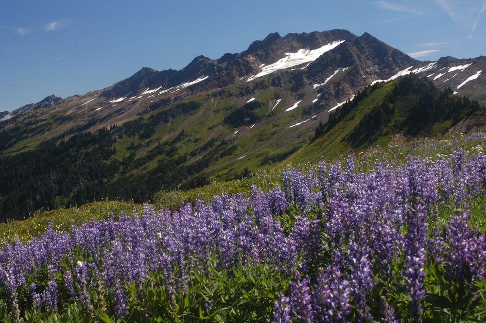

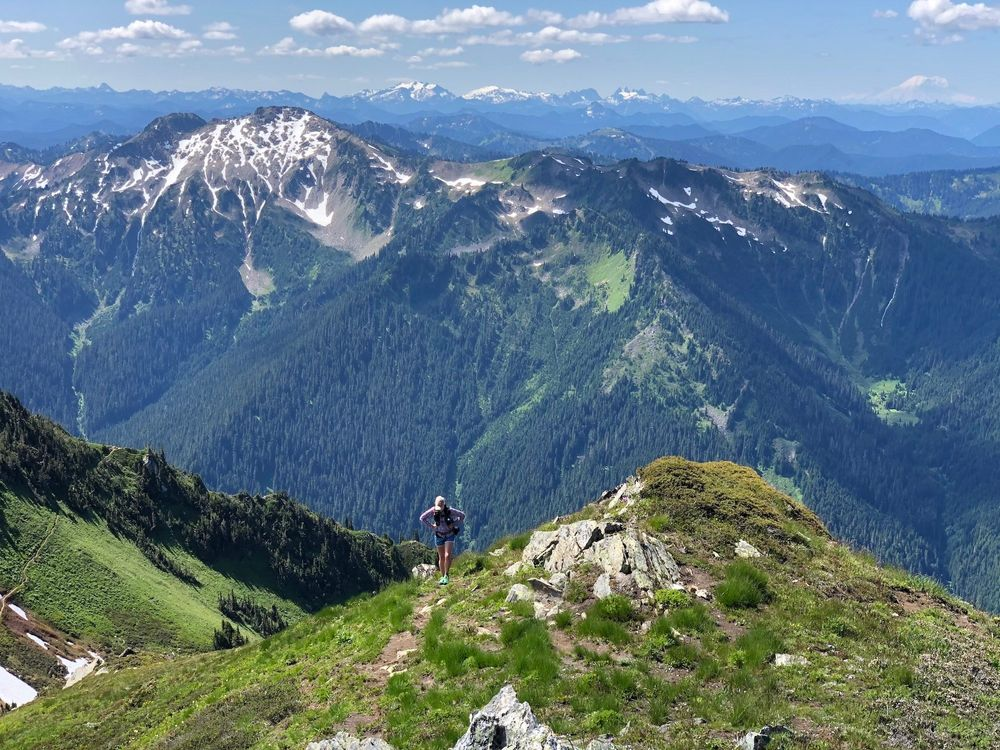

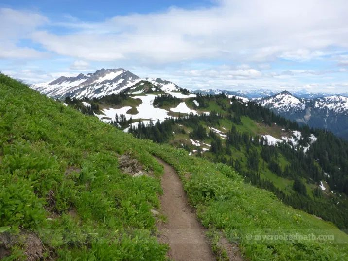

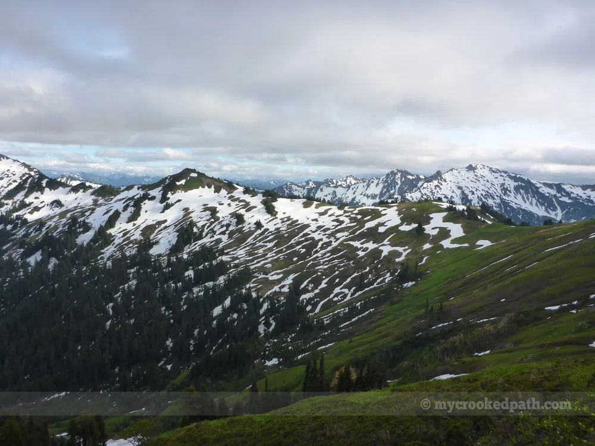

  <ReactTinyLink
    cardSize="small"
    showGraphic={true}
    url="http://mycrookedpath.com/blog/glacier-peak-summit/"
  />

  <ReactTinyLink
    cardSize="small"
    showGraphic={true}
    maxLine={2}
    minLine={1}
    url="https://www.trailchick.com/backpacking-the-white-pass-pilot-ridge-loop-in-the-glacier-peak-wilderness"
  />

