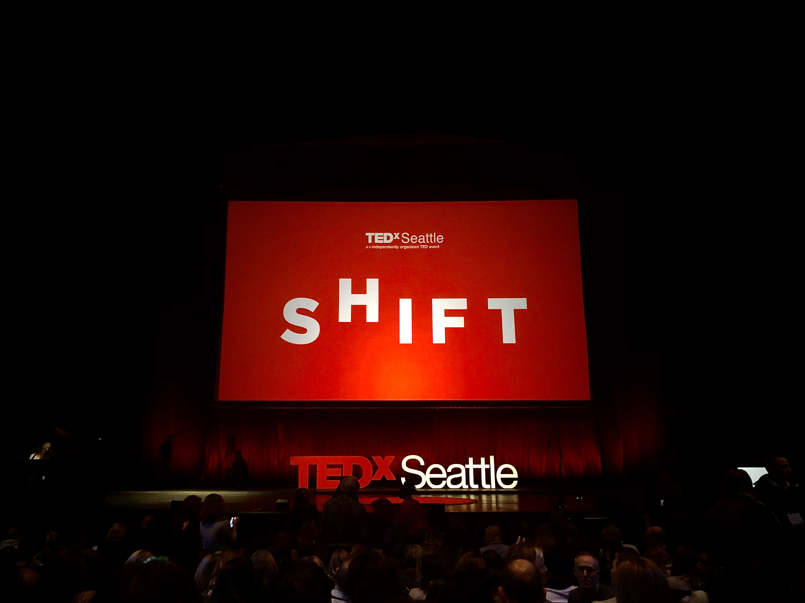

>
> **Ideas Worth Spreading**
>

This is my second TEDx. I've been to [TEDxPortland: Wonderland](https://history.tedxportland.com/wonderland) in 2017, and it absolutely blew my mind. I didn't have a chance to attend Seattle's show last year, so as soon as tickets went on sale in 2019, I grabbed one.

As I'm writing this, it's "Session 5" (the intermission); I'm sitting at the top level of jam-packed [McCaw Hall](https://www.mccawhall.com/) in Seattle, and I'm trying to process talks as they come.

## Pain and Virtual Reality

[Sam Sharar](https://tedxseattle.com/speakers/sam-sharar/) talked about using virtual reality to ease pain in severely burned patients. Convincing and a clear example of _fad_ technology being life-changing.

## Unconscious Bias

[Karen Okonokwo](https://tedxseattle.com/speakers/karen-okonkwo/) talked about unconscious bias when it comes to representation of black faces in various media, and how it affects non-white people growing up. It's eye-opening how we unconsciously perceive certain things as the norm just because we see them everywhere. Try for example searching for "couple" or "boss". Karen started a minority-focused stock photography website, and it's so awesome to see their work spreading around!

## Animal Advocacy

[Leah Garcés](https://tedxseattle.com/speakers/leah-garces/) talked about going to the perceived enemy and making a human connection to promote change. She's an avid animal advocate fighting with factory farming. It's awesome to see farmers turn their chicken factories into hemp and marijuana greenhouses! Also, Beyond Meat and Impossible Foods (and those who follow) are holding keys to the future of food. Yep. Called it!

## Creativity and Mental Health

[Ellen Forney](https://tedxseattle.com/speakers/ellen-forney/) gave a great talk about her journey through bipolar disorder. I can so much relate to her journey, but unlike Ellen I'm not ready to talk about it yet. Definitely buying her [Rock Steady](https://amzn.to/33gfapv) book - awesome book by a "crazy artist".

## Everyone Has a Story

[Traca Savadogo](https://tedxseattle.com/speakers/traca-savadogo/) talk was focused on striking a conversation with a stranger, and where this might lead. Excellent example of how we thinks that something might be awkward and miss out on great opportunities.

## Wisdom of Salmon

[![]]()

[Alexandra Morton]() explained how researching salmon and taking hints from orcas can make our lives so much better, make our water and air cleaner, and lead to a sustainable future of our species.  

## Art in Our Community

[![]]()

[James Miles]()

## Gene Editing - Eradicate HIV

[![]]()

There was some commotion before [Hans-Peter Kiem's]() talk, it happens every now and again when someone thinks they could just hijack the attention of 3000+ people at once; it never works, though. Anywho, apparently, CRISPR and other gene editing technologies are capable of curing HIV. And there is a way to deliver this cure to millions in our lifetime!

## Lessening Pain - Boosting Happiness

[![]]()

[Andrea Driessen]()

## Demystifying Complexity

[![]]()

[David Blatner]()

## Saving Beauty

[![Chris Jordan]]()

Perhaps, the most controversial talk by [Chris Jordan](). The main point was that we should stop scaring ourselves with climate change and turn to beauty. This was the only talk I can't agree with, and the only one not making it clear what exactly the speaker things is the answer (or at least what specific possible answers are there).
