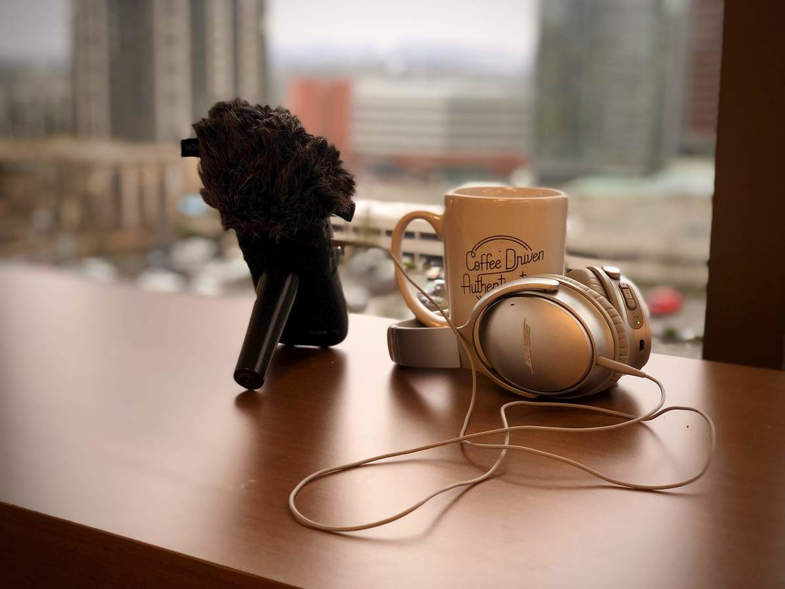
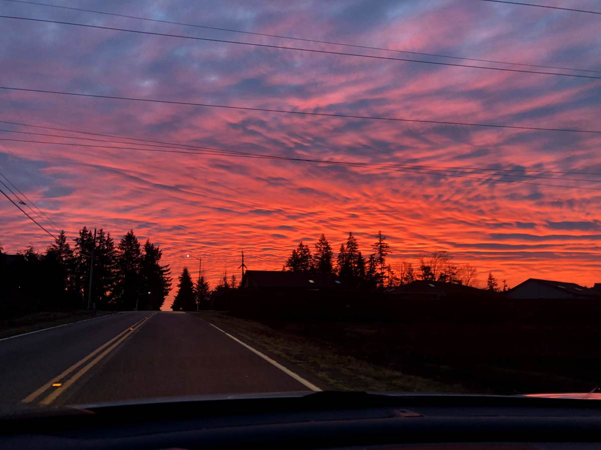
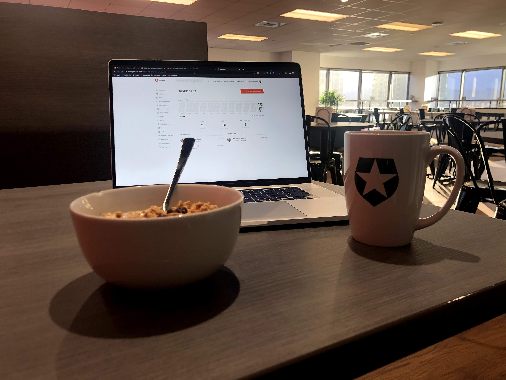
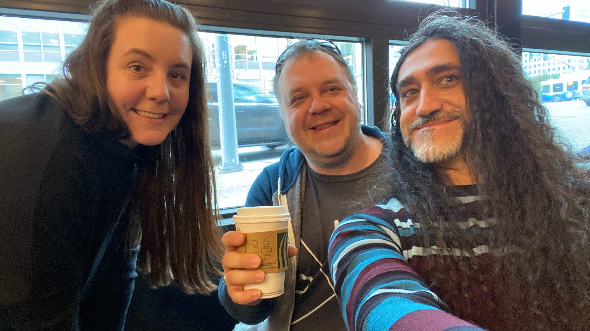
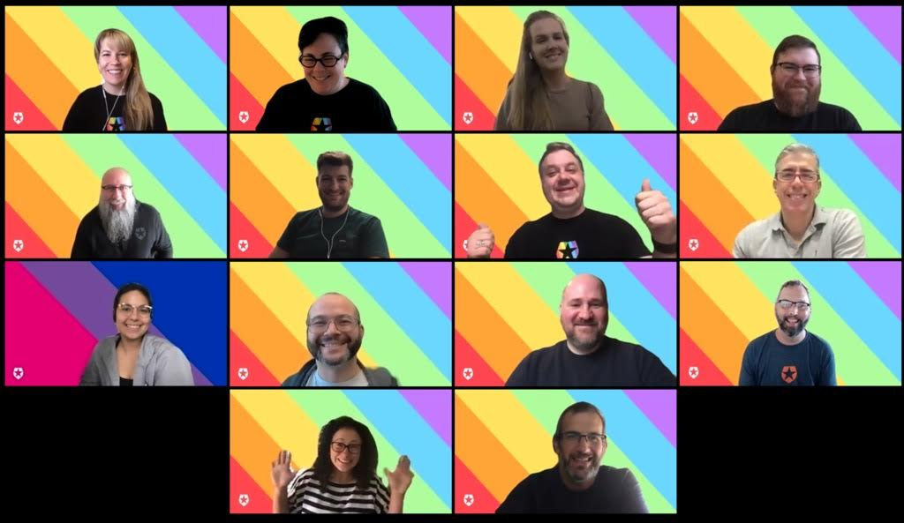

Looks like this place becomes more of a blog than I expected. Oh, well :) Today, I'm documenting a bunch of random things that I've been preoccupied with for the past few weeks (or maybe months?)

## Life

- Service
- Tattoo
- mental state
- Back on Twitter & LinkedIn
- Still can't stand Facebook & Instagram

## Work

- what we do and why
- helpful guides
- day to day
- incident response
- Opportunities (har viewer, rules, docs, etc)

### Weekend shifts

### Morning routine

### Donut

- team support

### Diversity and beyond

- Blood Drive
- Auth0 Gives (Australia)
- Mental Wellbeing club
- Pride club

### Things to look forward to

- Team offsite
- OOF 2020 in Cancun
- Overnight hike
- Helicopter ride
- Portland
- Seattle Dragons
- Bon Jovi
- Greenday
- Guns 'n Roses
- Splean

> We are hiring
