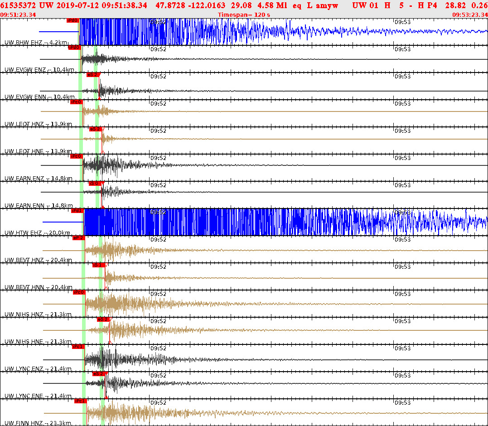

It's been a few weeks since I'd been woken up in the middle of the night by an earthquake. I just want to write this down since this was one of my first encounters with this natural phenomenon. I think, I've been through a light earthquake when I was visiting California in 1996, but I can't be sure, and I couldn't find any archival information (it was sometime in August 1996, somewhere either in Sacramento, or in LA area).

I was born and lived most of my life in the middle of Eurasian tectonic plate. Just to make it clear: it's a very, very stable, very thick and super solid tectonic plate. And when you're in the middle of it, there's no possibility of an earthquake happening, practically ever. You get some tremors from distant earthquakes every now and then, but they are in imperceptible range of magnitude 1-2.

After moving to Pacific Northwest in 2013, earthquakes suddenly became a real possibility. For the first five years in Cascades foothills along the Columbia river gorge, I was closely following seismic activities around us. With Mt. St. Helens visible from almost everywhere in Vancouver, WA, and Mt. Hood looming practically wherever you are, volcanos, eruptions, and earthquakes were always on my radar. I'd read about swarm quakes around one of the nearby volcanoes, or somewhere along the coast. Then I'd read that we had an earthquake last night somewhere real close (as in 20-30 miles), but it was, say, magnitude 2.5.

Years passed, and earthquakes were replaced _on my radar_ by more pressing issues (work, family, school and such). We moved north to Seattle area, and since mountains here are somewhat further away from our house than they were in Vancouver, and since the closest volcano, Mt. Rainier, is pretty far away, it all kinda faded away. I mean, I understand that nothing changed really; if anything, we are in a more tremor-prone are now with Juan de Fuca plate, and multiple faults right underneath our house, but it all somehow got less real, I guess...

And then you wake up at 2:51 am on a Friday night because your bed is shaking pretty violently, and the whole house is rattling and creaking for a whole 5-10 seconds.

Apparently, this is the third strongest earthquake in Washington in the last 10 years, two others being M4.9 in Poulsbo in 2009, and M4.7 near Okanagan in 2011. This one hit only 7 miles from home, in Monroe (I'm in Mill Creek), about 1 hour northeast of Seattle.

At first, I though a truck hit our house. We have a pretty quite straight street passing out house, and at night people do not really obey the 35 mph speed limit. They speed by, and at least on two occasions in the past 2 years, these racers hit parked cars on the street. So, my first assumption when my house stated shaking and making noises at night - someone hit the house with their car!

But then it went all quiet. Wife woke up, looked at the time on her phone, and went back to sleep (she later addmitted that she didn't understand why she randomly woke up in the middle of night, and angrily went back to sleep as in like, what the hell, why am I awake?!). Neighbors across the yard turned their patio lights, all was quite, but felt off. A few minutes later, another shake, much shorter (like, maybe a 2-3 seconds), but as noticeable. By this time, I realized what's going on, got up, met our completely freaked out cats just outside our bedroom, checked on my son (he didn't wake up), and checked twitter:

I never felt an earthquake before (at least, I can't remember it), and this was a jolt of an experience. We don't have any food or water for emergencies! I have no idea what to do in an earthquake (run? go outside? crawl under the bed??). So I spent the rest of the night reading through al the news about all the local earthquakes, [preparedness blogs](https://www.beyondsurvivalgear.com/11-survival-gear-essentials/), and so on. I'm still not prepared, but I'm on track!

Anyway, my point is, every now and then, theory you've known all along, becomes reality. Get ready and be prepared!

