It's hard to believe, but I've been listening to podcasts for over 14 years, and been podcasting myself since April 2006. Just think about it: back then Youtube had just pivoted from being [a dating site](https://www.cnet.com/news/youtube-started-as-an-online-dating-site/), Twitter had like 150 active users, Uber won't exist for another 3 years or so, and the most innovative mobile phone companies in the world are Nokia and Blackberry. Blockbuster was huge, and Lost was the biggest TV show of all time, still in Season 3 :)

Podcasting never took off the way video streaming did, but I don't think it's an issue. Spoken word historically loses to moving pictures in popularity, but more often then not wins in substance and depth. Not only this, but podcasts do not require the same level of focus and concentration as does, say, Youtube. You can't really drive and watch [Kurzgesagt](https://www.youtube.com/user/Kurzgesagt), but you can drive and listen to [Science Vs](https://gimletmedia.com/shows/science-vs).

Here's a list of my favorite podcasts. Some of them are in their second decade of running, some are pretty new, but all of them are a tremendous source of knowledge, news, and human experience as it relates to hitech industry in general, and software development in particular. Feel free to make a [pull request](https://github.com/rosnovsky/rosnovskyus/tree/master/content/blog/tech-podcasts-in-2019/index.md) if you think I've missed a great show here!

## Dev

Dev podcasts don't only provide a great deal of information and an amazing learning experience, but they also give a greater sense of community and feeling of belonging. Below is a list of podcasts that deal directly with software and web development.  

### 1. [Syntax](https://syntax.fm/) 

[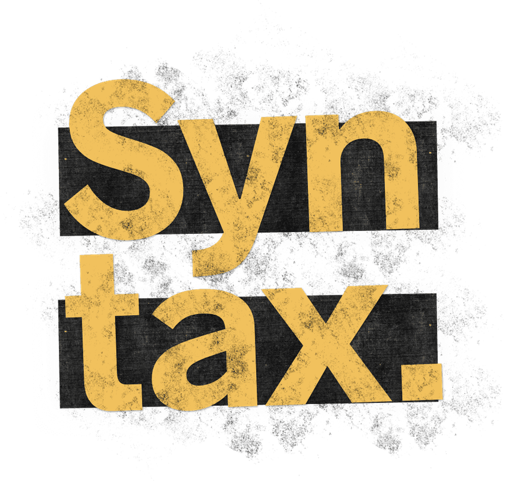](https://syntax.fm/) Relatively new and a real hit. Two hosts, Wes "Barracuda" Bos & Scott "El Toro Loco" Tolinski, normally make JavaScript courses and speak at conferences, but every now and then (more like a few times a week) they get together and talk shop. From general things like how do you advance as a freelancer or get your first dev job to the newest CSS tricks and _sick_ latest internalization features. "Potluck" Q&A episodes and pinpoint "Tasty Treats".   

<small>Syntax [iTunes](https://itunes.apple.com/ca/podcast/syntax-tasty-web-development-treats/id1253186678?mt=2) | Syntax [RSS](http://feed.syntax.fm/rss)</small>

---

### 2. [React Podcast](https://reactpodcast.simplecast.fm/)

It's all in the name. From interviews with core React team members to vision and in-depth specifics of the framework we all love (and [we do love it](https://2018.stateofjs.com/front-end-frameworks/overview/)!) to career discussions.

<small>React Podcast [iTunes](https://podcasts.apple.com/us/podcast/the-react-podcast/id1341969432) | React Podcast [RSS](https://rss.simplecast.com/podcasts/6265/rss)</small>

---

### 3. [Software Engineering Daily](https://softwareengineeringdaily.com/)

A broad look on basically all things software dev. This one is not specific to web development, though. To be honest, I don't have _that_ much time, and I do have a lot of other good podcasts to listen to, so personally, I skim shownotes of new episodes and listen to those that look promising. Interesting topics come up more often then not, but time is a finite resource, unfortunately.

<small>Software Engineering Daily [iTunes](https://podcasts.apple.com/us/podcast/software-engineering-daily/id1019576853?ls=1&mt=2) | Software Engineering Daily [RSS](https://softwareengineeringdaily.com/category/podcast/feed)</small>

---

### 4. [The Changelog](https://changelog.com/podcast)

The Changelog has been around for quite some time now. Episodes feature prominent engineers, developers, and other experts, and usually have a specific topic.

<small>The Changelog [iTunes](https://itunes.apple.com/us/podcast/the-changelog/id341623264) | The Changelog [RSS](https://changelog.com/podcast/feed)</small>

---

### 5. [JS Party](https://changelog.com/jsparty) 

🎉🎉🎉
Fun and casual, the kind of chat you'd like to be a part of. As serious as some topics are (burnout, anyone?), episodes are mostly on enspiring and empowering side.  

<small>JS Party [iTunes](https://itunes.apple.com/us/podcast/js-party/id1209616598) | JS Party [RSS](https://changelog.com/jsparty/feed)</small>

---

### 6. [Developer Tea](https://spec.fm/podcasts/developer-tea)

Developer Tea is on a shorter, bite-size side of podcasting. Inspiring and useful to both newbies and seasoned developers, and available to anyone with a 20+ minute commute. I even trained my Alexa to give me new Developer Tea in the morning, and most days their episodes fit nicely into my breakfast routine.   

<small>Developer Tea [iTunes](https://geo.itunes.apple.com/ca/podcast/feed/id955596067) | Developer Tea [RSS](http://feeds.feedburner.com/developertea)</small>

---

### 7. [Full Stack Radio](http://www.fullstackradio.com/)

[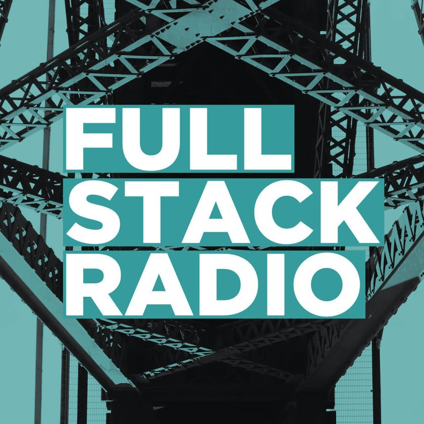](http://www.fullstackradio.com/)

Weekly in-depth interview show with Adam Wathan. Sometimes I listen to the guests 

<small>Full Stack Radio [iTunes](https://geo.itunes.apple.com/ca/podcast/feed/id955596067) | Full Stack Radio [RSS](https://rss.simplecast.com/podcasts/279/rss)</small>

---

### 8. [Shop Talk](https://shoptalkshow.com/)

[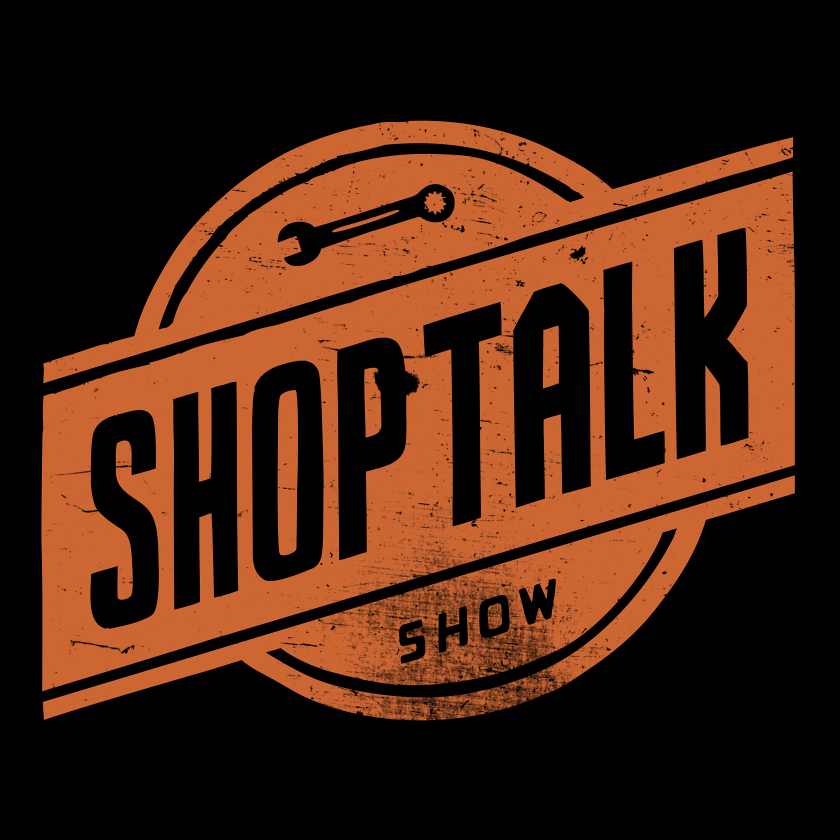](https://shoptalkshow.com/)

Another great show about frontend development, web design and all things UX. It's interesting how sometimes you here the same guests on different podcasts from this list, but every host and every show has a different angle and offers a different conversation. Exciting guests, great in-depth conversations.  

<small>Shop Talk [iTunes](http://itunes.apple.com/podcast/id493890455) | Shop Talk [RSS](https://shoptalkshow.com/feed/podcast)</small>

---

### 9. [FreeCodeCamp](https://freecodecamp.libsyn.com/)

FreeCodeCamp is one of the absolutely best and completely free and open-source resources for learning software development. It's been growing like crazy, has incredible community of passionate people who are happy to share their knowledge and help out the newbies. Their podcast is no exception: awesome guests, stimulating topics, success stories and so much more. Highly recommended!

<small>FreeCodeCamp [iTunes](https://itunes.apple.com/us/podcast/the-freecodecamp-podcast/id1313660749?mt=2&ls=1) | FreeCodeCamp [RSS](http://podcast.freecodecamp.org/rss)</small>

---

### 10. [Second Career Devs](https://secondcareerdevs.com/) 

Kyle talks with people who became software engineers after they had a previous career in other fields. This one is oparticularly dear to me since I've been a journalist and a radio host in my _previous life_, and can very much relate as being a second career developer myself. 

<small>Second Career Devs [iTunes](https://podcasts.apple.com/us/podcast/second-career-devs/id1317467797) | Second Career Devs [RSS](http://feeds.soundcloud.com/users/soundcloud:users:332558027/sounds.rss)</small>

---

### 11. [Maintainable](https://maintainable.fm/) 

[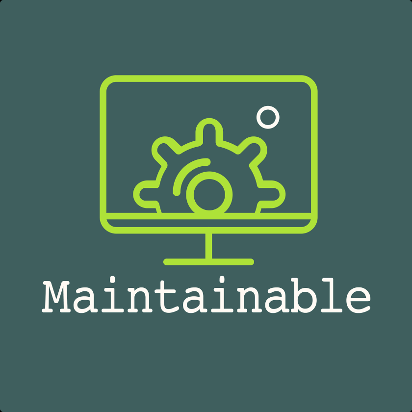](https://maintainable.fm/)

Legacy code, technical debt, and how to maintain and advance older projects (personal or at work). This one is tailored more towards seaoned developers audience, but anyone could bemnefit regardless of current experience level.

<small>Maintainable [iTunes](https://podcasts.apple.com/us/podcast/maintainable/id1459893010) | Maintainable [RSS](https://feeds.simplecast.com/7y1CbAbN)</small>

---

### 12. [CodePen Radio](https://blog.codepen.io/radio/) 

[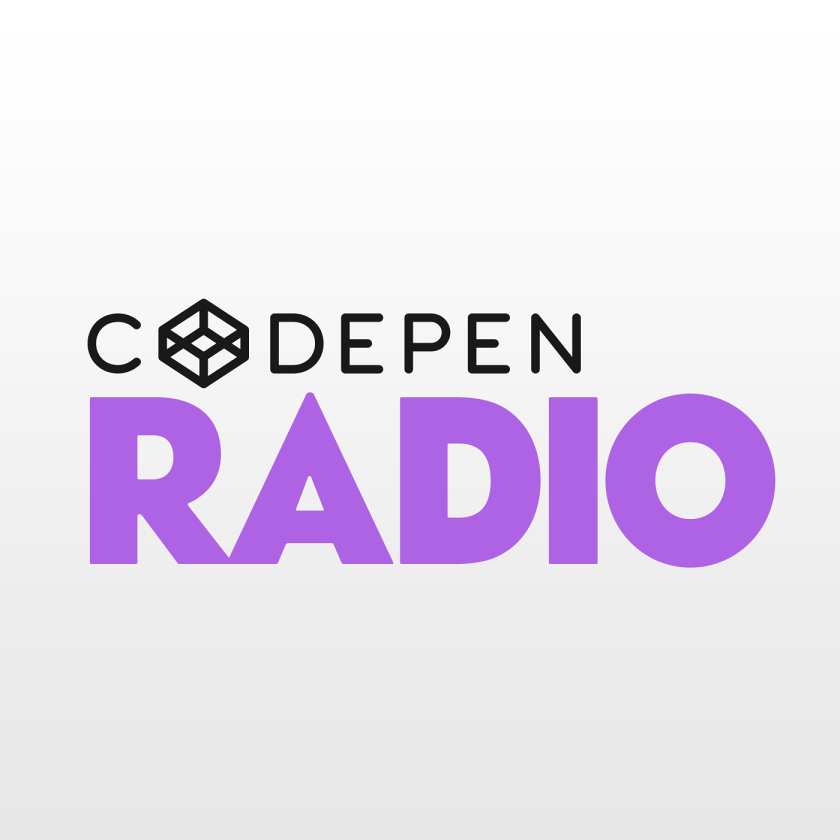](https://blog.codepen.io/radio/)

CodePen is an awesome tool to quickly prototype a feature, showcase some code, do an excersice or collaborate on a project. They run an insightful podcast about, well, running a web software business.  

<small>CodePen Radio [iTunes](https://itunes.apple.com/us/podcast/codepen-radio/id824437159) | CodePen Radio [RSS](https://blog.codepen.io/feed/podcast/)</small>

---

### 13. [Coding Blocks](https://www.codingblocks.net/) 

> Podcast about computer programming and software development so you can learn on the go. 

Indeed. Topics vary greatly, but you'll find yourself diving deep into different programming concepts and learning a whole lot of new stuff every month.

<small>Coding Blocks [iTunes](https://podcasts.apple.com/podcast/coding-blocks-software-web/id769189585) | Coding Blocks [RSS](https://www.codingblocks.net/podcast-feed.xml)</small>

---

## General Tech Talk

Quick Intro

### 14. [This Week in Tech](https://www.twit.tv/shows/this-week-in-tech)

[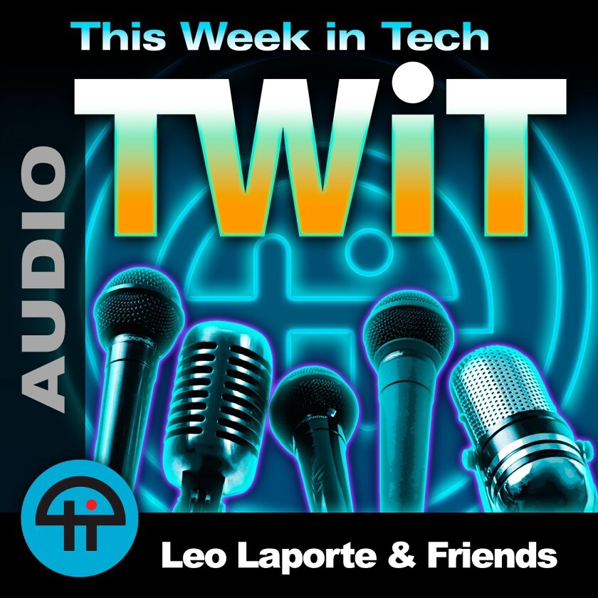](https://www.twit.tv/shows/this-week-in-tech)

Leo Laporte is a true legend and one of the pioneers of podcasting. His [TWiT](https://www.twit.tv/) network runs a whole bunch of shows, from Cyber Security to iOS to daily tech news. I consider This Week in Tech to be the weekly tech news podcast.

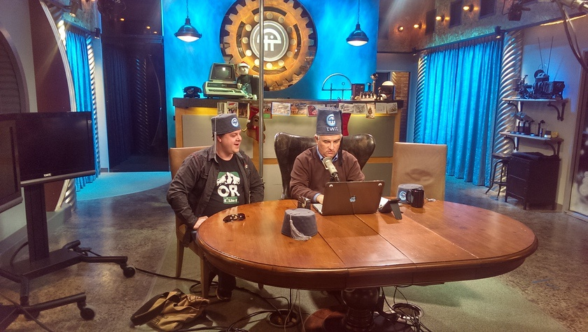
P.S. I've met with Leo once a while back, it was fun :)

<small>This Week in Tech [iTunes](https://podcasts.apple.com/us/podcast/this-week-in-tech-mp3/id73329404?uo=10) | This Week in Tech [RSS](http://feeds.twit.tv/twit.xml)</small>

### 15. [Accidental Tech Podcast](https://atp.fm/)

[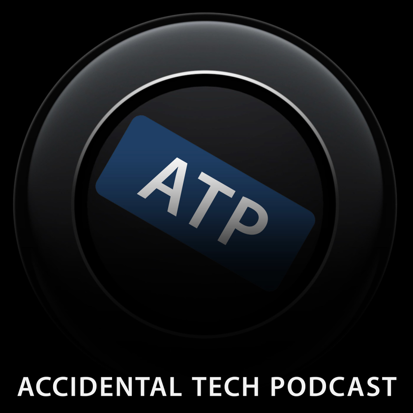](https://atp.fm/)

Marco Arment, Casey Liss, and John Siracusa, a trio of well-known software developers, writers and producers, run this very special show. It's both sarcastic, and optimistic, and all-doom-and-gloom at times, but then it's something else completely. It's all over the place in the best sence possible. It is quite heavily Apple-leaning, since hosts been covering Apple or working with Apple stack for decades. Marco Arment, for instance, is the person responsible for [Overcast](https://overcast.fm/), without a doubt the best podcast app out there. 

<small>Accidental [iTunes](https://itunes.apple.com/us/podcast/accidental-tech-podcast/id617416468) | Accidental [RSS](http://atp.fm/episodes?format=rss)</small>

### 16. [Indie Hackers](https://www.indiehackers.com/podcast)

[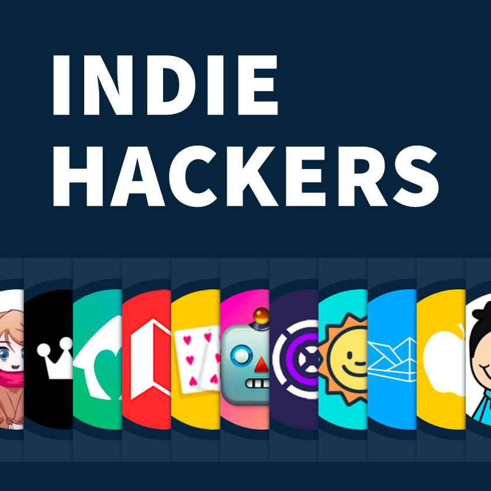](https://www.indiehackers.com/podcast)

I couldn't skip Indie Hackers, although this is probably one of the podcasts that I'm not entirely sure I like :) Sometimes it's a lot of hype, and guests are this self-made kind of know-it-alls, but then they strike gold with a meaningful, inspiring, and overall great conversation with someone who's humble because they _truly_ know their stuff. Hit and miss, in short, but still worth a sub.

<small>Indie Hackers [iTunes](itms://itunes.apple.com/us/podcast/indie-hackers-podcast-how/id1206165808) | Indie Hackers [RSS](https://feeds.backtracks.fm/indiehackers/indie-hackers-podcast/feed.xml)</small>

---

## Apple/Mac

Quick intro

### 17. MacBreak Weekly

[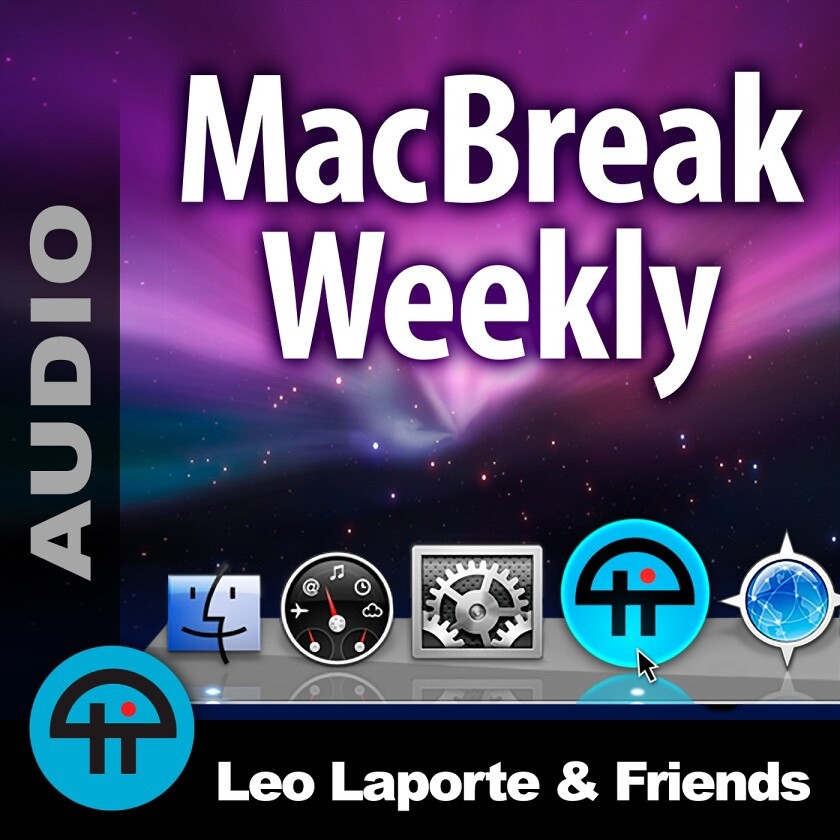](https://www.twit.tv/shows/macbreak-weekly)

This is the oldes Mac and Apple show in existence; I remember watching one of the first ever HD videos I've ever watched, like, 50 years ago or something, and this first video was one of the how-to episodes of MBW (I still remember the openening score along with the video, and how long it took to download, and how very jittery it was on my old computer). One of my all-time favorites.

<small>MacBreak Weekly [iTunes](https://podcasts.apple.com/us/podcast/macbreak-weekly-mp3/id179237749?uo=10) | MacBreak Weekly [RSS](http://feeds.twit.tv/mbw.xml)</small>

### 18. Upgrade

[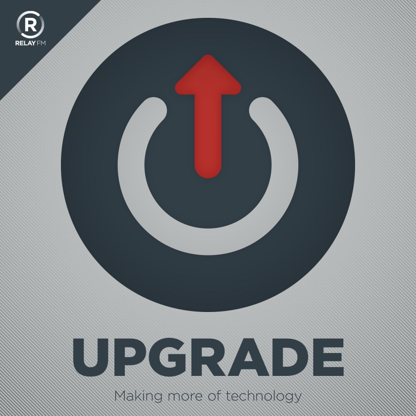](https://www.relay.fm/upgrade)

Co-founder of Relay.fm network Myke Hurley and his legendary co-host Jason Snell, in a heavily Apple leaning show about tech. They tend to look at all the tech scene through _Apple glasses_, and they do a great job spinning Apple stuff.

<small>Upgrade [iTunes](https://itunes.apple.com/us/podcast/upgrade/id918152703) | Upgrade [RSS](https://overcast.fm/itunes918152703/upgrade)</small>

### 19. Vector

Rene Ritchie of iMore runs this (almost) daily (and sometimes twice-a-day) show about personal tech in general and Apple tech in particular. Rene is great at explaining things, and usualy he gets to the bottom of whaterver he's talking about before actually talking about it. 

<small>Vector [iTunes](http://applepodcasts.com/vector) | Vector [RSS](http://vector.libsyn.com/rss)</small>

### 20. Connected

A unique mix of perspectives and accents. Apple-focused, this show offers a great deal of commentary and opinions you might disagree with. Just saying :)

<small>Connected [iTunes](https://itunes.apple.com/us/podcast/id909109652) | Connected [RSS](https://overcast.fm/itunes909109652/connected)</small>

## Google/Android

Quick intro

### 21. This Week in Google

<small>This Week in Google iTunes | This Week in Google RSS</small>

### 22. Material Podcast

<small>Material Podcast iTunes | Material Podcast RSS</small>

### 23. All About Android

<small>All About Android iTunes | All About Android RSS</small>

## Microsoft/Windows

Quick intro

### 24. Windows Weekly

<small>Windows Weekly iTunes | Windows Weekly RSS</small>

### 25. This Week in Channel 9

<small>TWiC9 iTunes | TWiC9 RSS</small>

### 26. Windows Central Podcast

<small>Windows Central iTunes | Windows Central RSS</small>

## General

Quick intro

### 27. Science Vs

<small>Science Vs iTunes | Science Vs RSS</small>

### 28. [Liftoff](https://www.relay.fm/liftoff)

<small>Liftoff iTunes | Liftoff RSS</small>

### 29. Inside Intercom

<small>Inside Intercom iTunes | Inside Intercom RSS</small>
### 30. 99% Invisible

<small>99% invisible iTunes | 99% invisible RSS</small>