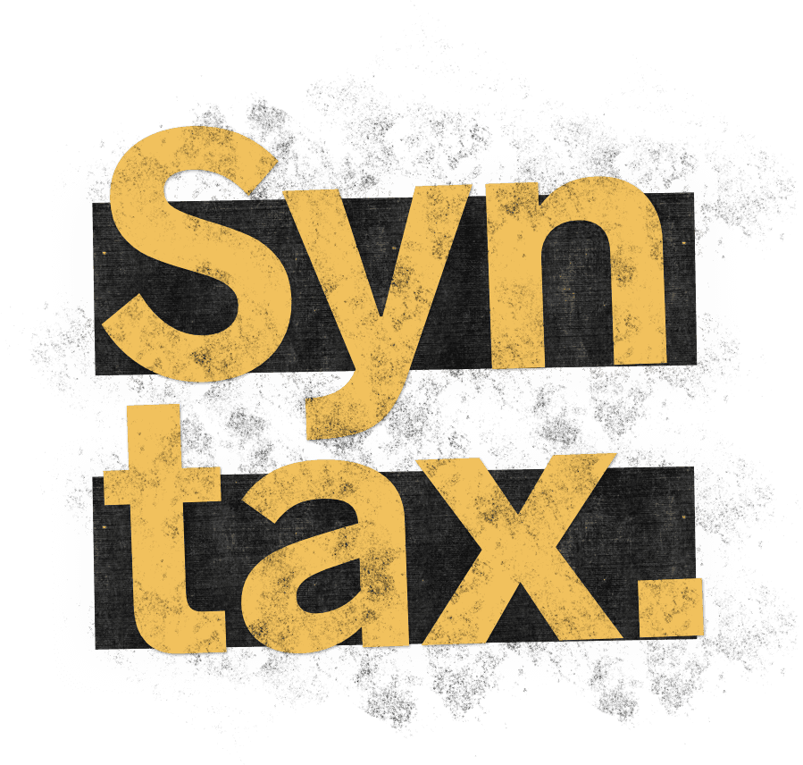

It's hard to believe, but I've been listening to podcasts for over 14 years, and been podcasting myself since April 2006. Just think about it: back then Youtube had just pivoted from being [a dating site](https://www.cnet.com/news/youtube-started-as-an-online-dating-site/), Twitter had like 150 active users, Uber won't exist for another 3 years or so, and the most innovative mobile phone companies in the world are Nokia and Blackberry. Blockbuster was huge, and Lost was the biggest TV show of all time, still in Season 3 :)

Podcasting never took off the way video streaming did, but I don't think it's an issue. Spoken word historically loses to moving pictures in popularity, but more often then not wins in substance and depth. Not only this, but podcasts do not require the same level of focus and concentration as does, say, Youtube. You can't really drive and watch [Kurzgesagt](https://www.youtube.com/user/Kurzgesagt), but you can drive and listen to [Science Vs](https://gimletmedia.com/shows/science-vs).

Here's a list of my favorite podcasts. Some of them are in their second decade of running, some are pretty new, but all of them are a tremendous source of knowledge, news, and human experience as it relates to hitech industry in general, and software development in particular. Feel free to make a [pull request](https://github.com/rosnovsky/rosnovskyus/tree/master/content/blog/tech-podcasts-in-2019/index.md) if you think I've missed a great show here!

## Dev

Dev podcasts don't only provide a great deal of information and an amazing learning experience, but they also give a greater sense of community and feeling of belonging. Below is a list of podcasts that deal directly with software and web development.  

### [Syntax](https://syntax.fm/) 

(https://syntax.fm/) Relatively new and a real hit. Two hosts, Wes "Barracuda" Bos & Scott "El Toro Loco" Tolinski, normally make JavaScript courses and speak at conferences, but every now and then (more like a few times a week) they get together and talk shop. From general things like how do you advance as a freelancer or get your first dev job to the newest CSS tricks and _sick_ latest internalization features. "Potluck" Q&A episodes and pinpoint "Tasty Treats".   

<small>Syntax [iTunes](https://itunes.apple.com/ca/podcast/syntax-tasty-web-development-treats/id1253186678?mt=2) | Syntax [RSS](http://feed.syntax.fm/rss)</small>

---

### React Podcast

It's all in the name. From interviews with core React team members to vision and in-depth specifics of the framework we all love (and [we do love it](https://2018.stateofjs.com/front-end-frameworks/overview/)!).

<small>React iTunes | React RSS</small>

---

### Software Engineering Daily

A broad look on basically all things software dev.  

<small>Software Engineering Daily iTunes | Software Engineering Daily RSS</small>

---

### The Changelog

<small>The Changelog iTunes | The Changelog RSS</small>

---

### [JS Party](https://changelog.com/jsparty) 

<small>JS Party iTunes | JS Party RSS</small>

---

### [Developer Tea](https://spec.fm/podcasts/developer-tea)

<small>Developer Tea [iTunes](https://geo.itunes.apple.com/ca/podcast/feed/id955596067) | Developer Tea [RSS](http://feeds.feedburner.com/developertea)</small>

---

### [Full Stack Radio](http://www.fullstackradio.com/)

<small>Full Stack Radio [iTunes](https://geo.itunes.apple.com/ca/podcast/feed/id955596067) | Full Stack Radio [RSS](https://rss.simplecast.com/podcasts/279/rss)</small>

---

### [Shop Talk](https://shoptalkshow.com/)

<small>Shop Talk [iTunes](http://itunes.apple.com/podcast/id493890455) | Shop Talk [RSS](https://shoptalkshow.com/feed/podcast)</small>

---

### [FreeCodeCamp](https://freecodecamp.libsyn.com/)

<small>FreeCodeCamp [iTunes](https://itunes.apple.com/us/podcast/the-freecodecamp-podcast/id1313660749?mt=2&ls=1) | FreeCodeCamp [RSS](http://podcast.freecodecamp.org/rss)</small>

---

### [Second Career Devs](https://secondcareerdevs.com/) 

<small>Second Career Devs [iTunes](https://podcasts.apple.com/us/podcast/second-career-devs/id1317467797) | Second Career Devs [RSS](http://feeds.soundcloud.com/users/soundcloud:users:332558027/sounds.rss)</small>

---

### [Maintainable](https://maintainable.fm/) 

<small>Maintainable [iTunes](https://podcasts.apple.com/us/podcast/maintainable/id1459893010) | Maintainable [RSS](https://feeds.simplecast.com/7y1CbAbN)</small>

---

### [CodePen Radio](https://blog.codepen.io/radio/) 

<small>CodePen Radio [iTunes](https://itunes.apple.com/us/podcast/codepen-radio/id824437159) | CodePen Radio [RSS](https://blog.codepen.io/feed/podcast/)</small>

---

### [Coding Blocks](https://blog.codepen.io/radio/) 

<small>Coding Blocks [iTunes](https://podcasts.apple.com/podcast/coding-blocks-software-web/id769189585) | Coding Blocks [RSS](https://www.codingblocks.net/podcast-feed.xml)</small>

---

## General Tech Talk
- This Week in Tech
- Accidental Tech Podcast (heavily Apple leaning)

### Indie Hackers

<small>Syntax iTunes | Syntax RSS</small>

---

## Apple/Mac
- MacBreak Weekly
- Upgrade
- Vector
- Connected

## Google/Android
- This Week in Google
- Material Podcast
- All About Android

## Microsoft/Windows
- Windows Weekly
- This Week in Channel 9

## General
- Science Vs
- [Liftoff](https://www.relay.fm/liftoff)
- Inside Intercom
- 99% Invisible
- The Daily
